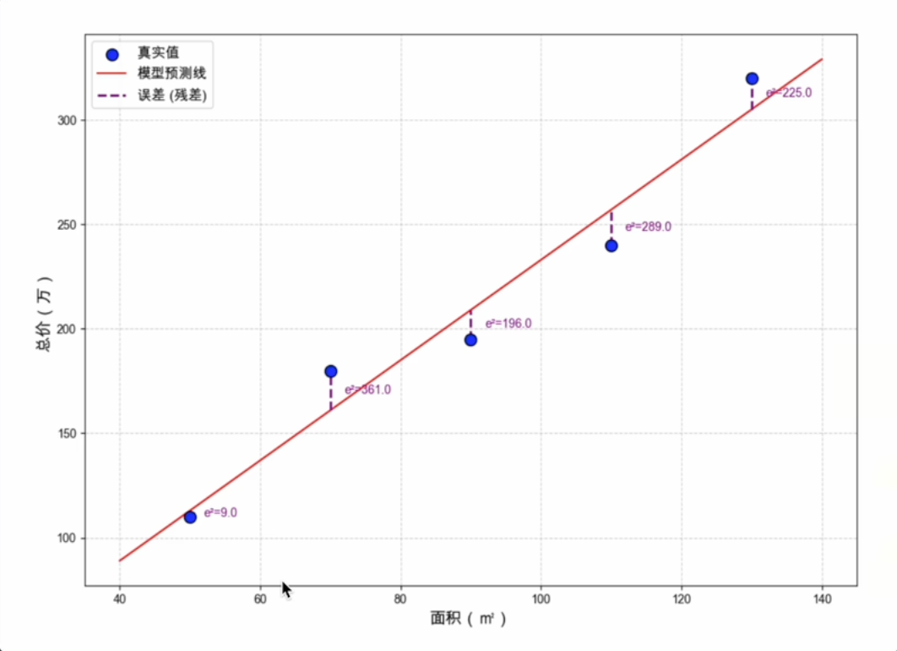
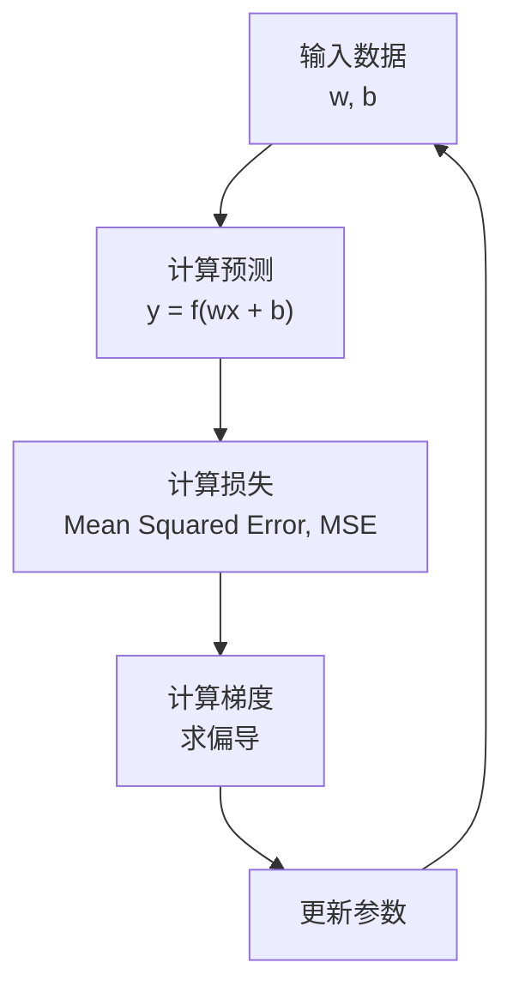

## 线性回归
**线性回归**，也就是把一组数据放在坐标轴里，找一根线（或者一个平面、超平面）能穿过这些点，或者这根线尽可能靠近这些点，就叫线性回归。

线性，指的是输入与输出之间按比例变化，可叠加的关系。线性关系在一维空间中表现为一条线，在高维空间中则表现为平面或者超平面。一个映射 $f$ 满足：
1. 齐次性： $f(ax) = a \cdot f(x)$
2. 可加性： $f(x+y) = f(x) + f(y)$

回归，这词是源于统计学家弗朗西斯·高尔顿的研究，他观察到，身高极高或极矮的父母，其子女的身高往往会向群体平均值靠拢，这个线性称为“回归均值“。
在机器学习领域，回归的概念就被进一步引申：旨在通过数据建模变量间的映射关系 $f$，进而实现对 **连续** 数值的预测。

最简单的线性回归模型只有一个特征，预测公式为：
$$
\hat y = wx + b
$$

- $\hat y$: 模型预测值（如预测房价）
- $x$: 输入特征（如面积）
- $w$: 权重（weight，斜率） —— 面积每增加 1m^2^, 房价变化多少
- $b$: 偏置（bias，截距） —— 当面积为 0 时的理论基准值

> 这里 $w$ 和 $b$ 就是模型需要学习的参数，训练模型本质上就是搜索一组最合适的 $w$ 和 $b$。

---

## 损失函数

训练以后我们得到一组参数（例如 $w$ 和 $b$），那如何知道这组参数准不准，就得一种方法来度量预测值与真实值之间的偏差，也就是 **损失函数（Loss Function）**。
> 预测值离真实值越远，损失越大。模型训练的目标就是让损失函数的值尽可能小。

线性回归中最常用的损失函数就是 **均方误差（Mean Squared Error, MSE）**。
1. 对每个样本，计算 预测值 - 真实值（即误差）；
2. 讲误差取平方（消除正负号，放大较大误差，鼓励向较小误差前进）；
3. 对所有样本求平均。

$$
MSE = \frac {1}{n} \sum (\hat y - y)^2
$$

MSE 的两个主要好处是：
1. 消除正负号的影响：让误差绝对值化，防止求和之后正负误差相互抵消；
2. 放大误差便于优化：例如误差 3 和 0.4，平方后为 9 和 0.16，差异更明显。

---

## 梯度下降

知道预测值和真实值有多不准以后，要怎么优化呢（优化，比如如何自动调整 $w$ 和 $b$）？
最通用的算法是 **梯度下降（Gradient Descent）**：沿着损失函数下降最快的方向，逐步调整参数，直到找到最优解。
说白了就是 **对损失函数求导**。我们对多个特征求偏导（也就是它的斜率），求导之后我们也就知道了该特征变化的方向。那我们一点一点试就能知道这个特征的值是不是偏大了，大了就调小试试，小了就调大。
慢慢的也就离真实值越来越近，也就逐步取到了最优解。

> 形象比喻：蒙眼下山
> 1.感知坡度（计算梯度，也就是计算偏导）：盲人用脚探知当前所处的坡度方向，确定哪里是下坡；
> 2. 迈出一小步 (更新参数)：顺着最陡峭的下坡方向(负梯度方向)，迈出一步；
> 3. 循环往复 (迭代优化)：在新位置继续感知坡度，继续向下走；
> 4. 到达谷底(模型收敛)：当走到再也没有下坡路的地方，即认为到达了最低点。

---

模型训练的核心循环就

把下山的比喻和机器学习的概念对应一下：
- 山的当前高度 = 损失函数的值（Loss）
- 下坡的方向 = 梯度（Gradient，即偏导数）
- 每一步迈多大 = 学习率（Learning Rate）；步子迈大了容易过头哦

训练流程：

每完成一轮循环，参数就更接近一点，经过多轮迭代模型逐渐收敛到最优解。

---

现实问题往往不止一个 $x$, 假设现有 $d$ 个特征，模型自然地扩展为：

$$
\hat y = w_1x_1 + w_2x_2 + w_3x_3 + ... + w_dx_d + b
$$

比如：

$$
\hat y = w_1 \cdot x_{面积} + w_2 \cdot x_{楼层} + w_3 \cdot x_{距地铁} + w_4 \cdot x_{房龄} + b
$$

- $w1$ (面积)：+ 正，面积越大，房价越高
- $w2$ (楼层)：+ 正，中高楼层通常更贵
- $w3$ (距地铁)：- 负，离地铁越远，房价越低
- $w4$ (房龄)：- 负，房子越老，房价越低

那梯度下降就是对参数 $w$ 和 $b$ 求偏导并调整它们。

当特征比较多的时候，公式会比较冗长，可以借助向量的记号写得更简洁：
$$
\hat y = w^Tx + b = \sum^{d}_{i=1}w_ix_i + b, \;
其中 \; 
x = \begin{bmatrix}
x_1 \\
x_2 \\
... \\
x_d
\end{bmatrix},
w = \begin{bmatrix}
w_1 \\
w_2 \\
... \\
w_d
\end{bmatrix}
$$

> 不管是 1 个特征还是 100 个特征，模型的本质结构完全一样 —— 都是特征的加权求和再加偏置。

---

现实中的数据，也就是每个特征 $x$ 并不一定总是沿着一条直线分布，例如当房价随面积的增长先慢后快时，直线 $x^1$ 就无法很好的拟合了。
这时可以引入多项式回归：

$$
\hat y = w_1x + w_2x^2 + ... + w_dx^d + b
$$

- 当 $d = 1$ 时，就是普通线性回归；
- 当 $d = 2$ 时，拟合出的是一条抛物线；阶数越高，曲线就越灵活。

> 尽管公式中出现了 $x_2$, $x_3$ 等非线性项，但模型对参数仍然是线性的（ $\hat y$ 是 $w_1, w_2, ... w_d, b$ 的线性组合）。
> 因此多项式回归本质上仍属于广义线性模型的范畴，可以用于线性回归相同的方法求解。

记住：
1. 线性回归画的不一定是直线；
2. 线性回归指的是对参数 $w, b$ 是线性的，而非对输入特征 $x$；
3. 特征 $x$ 不是线性的时候就称之为多项式回归，本质上还是线性回归。

---

总结，线性回归虽然简单，但包含了机器学习的核心思想：
1. 用数据寻找规律
2. 用模型表达规律
3. 用损失函数衡量误差
4. 用梯度下降优化参数
5. 不断训练让模型变得更准确（损失函数接近 0）

