# P2P、NAT 穿透与现代连接协议梳理

> 把 NAT、打洞、STUN/TURN/ICE、信令、WebRTC、WireGuard、ngrok、Tailscale 这些名词放在同一张图里讲清楚。

---

## 一、问题的起点：为什么 P2P 这么难

互联网的现实：**绝大多数终端都在 NAT 后面**（家用路由器、4G 基站、企业防火墙）。

NAT 的核心特征：

- 内网地址（如 `192.168.1.5`）**不在公网路由表里**，公网无法直接访问内网
- NAT 维护一张映射表：`内网 IP:Port ↔ 公网 IP:Port`
- **映射只在内网主动出包时建立**，公网无法主动打进来

P2P 的根本矛盾：

> 双方都在 NAT 后面 → 谁也无法被对方主动连接 → 但又想直连。

围绕这个矛盾，演化出了三层解决方案：

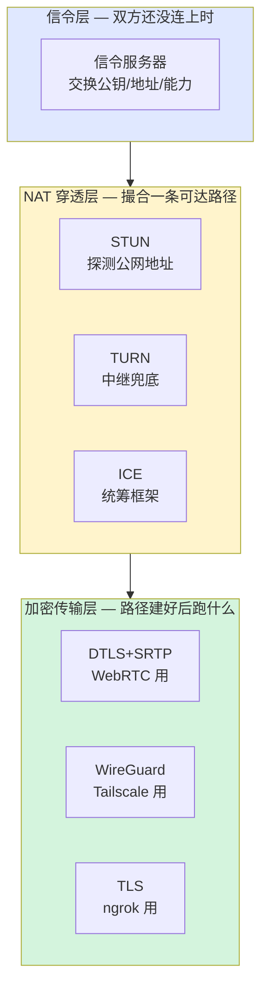

**三层各干各的事，互不替代**。后面所有名词都能按这三层归位。

---

## 二、NAT 类型与穿透的可能性

不是所有 NAT 都能打洞。常见 NAT 行为：

| 类型 | 特征 | 能打洞吗 |
|---|---|---|
| Full Cone | 一个内网端口对应一个公网端口，谁都能打进来 | 容易 |
| Restricted Cone | 公网端口固定，但只允许"我发过包的对端"打进来 | 可以 |
| Port Restricted | 同上，连源端口都要匹配 | 可以 |
| **Symmetric** | **每个目标地址用不同的公网端口** | **基本无解** |

> **Symmetric NAT** 是 P2P 的天敌：你向 STUN 服务器探测出的公网地址，跟你真正发给对端时用的公网地址**不是同一个**，所以打洞拿到的地址用不了。

工程上的应对：**先尝试打洞，失败就走中继**。这就是后面 ICE 和 TURN/DERP 存在的理由。

---

## 三、UDP Hole Punching 时序

最经典的打洞流程，双方都在 NAT 后，借助一个公网协调服务器 S：

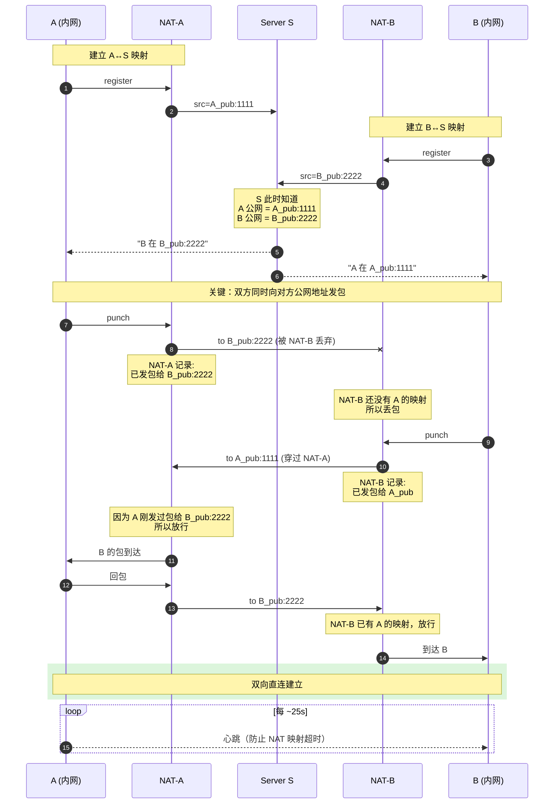

**记三点就够：**

1. **第一个 punch 包必然丢**，它的作用只是在自家 NAT 上"开门"
2. **必须几乎同时发**，否则一方先发可能因为对方 NAT 拒绝/超时而失败
3. **Symmetric NAT 必败**：S 看到的地址和 A 发给 B 时用的地址不是同一个，B 收到的指引地址错的

---

## 四、STUN — "镜子"

**全称**：Session Traversal Utilities for NAT
**作用**：告诉客户端"你在公网上看起来是什么地址"

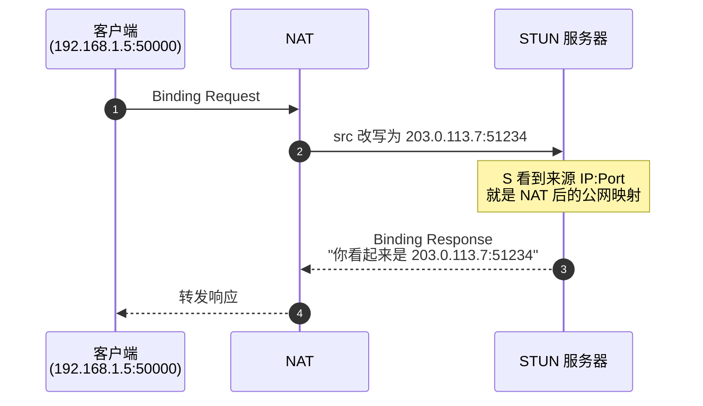

**特点：**

- 极轻量，UDP，一次请求一次响应
- **不转发用户数据**，只是面镜子
- 不能解决 Symmetric NAT
- 公开的免费 STUN 服务器很多（如 `stun.l.google.com:19302`）

---

## 五、TURN — "邮局"

**全称**：Traversal Using Relays around NAT
**作用**：打洞失败时，找台公网服务器替你转包

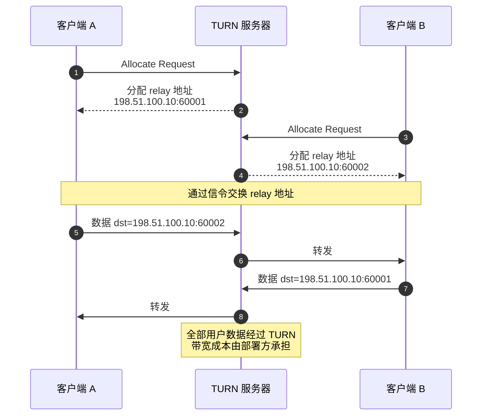

**STUN vs TURN 速记：**

| 维度 | STUN | TURN |
|---|---|---|
| 干什么 | 告诉你公网地址 | 替你中继数据 |
| 流量经过 | 不经过 | **全部经过** |
| 带宽成本 | 几乎为零 | 高 |
| 成功率 | 中等 | 接近 100% |
| 协议关系 | 基础协议 | STUN 的扩展 |

---

## 六、ICE — "统筹框架"

**全称**：Interactive Connectivity Establishment
**作用**：把"本地地址、STUN 反射地址、TURN 中继地址"全部当候选，并发尝试，挑最优。

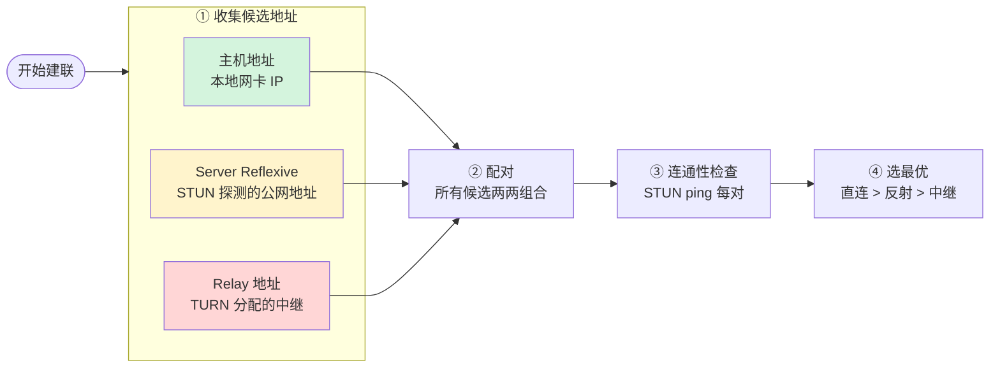

**优先级**：直连 LAN > STUN 反射地址直连 > TURN 中继。

---

## 七、信令服务器 — "撮合者"

**根本问题**：双方还没连上之前，怎么交换"我的公钥/地址/能力"？答案是**经过一个公网中间人**。

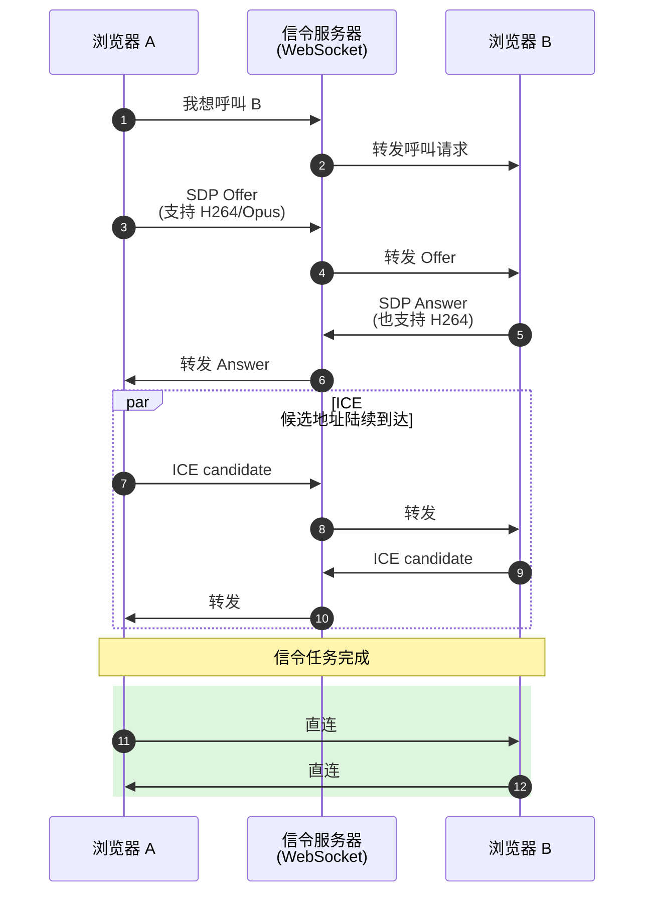

**特点：**

- **不传媒体数据**，只交换元信息（编码能力、加密参数、候选地址）
- **协议自由**：WebRTC 故意不规定信令协议——WebSocket、HTTP 长轮询、MQTT、甚至二维码扫码都行
- 通常跟业务的账号系统绑在一起（谁能呼叫谁、房间号、权限）

**信令 vs STUN/TURN 的容易混点：**

| | 信令服务器 | STUN | TURN |
|---|---|---|---|
| 解决什么 | 双方"加好友"交换元信息 | 我的公网地址是什么 | 打不通时帮我转包 |
| 传输内容 | SDP、ICE 候选、控制信令 | Binding 请求/响应 | 用户数据本身 |
| 带宽 | 极低 | 极低 | 高 |
| 标准化 | 不在 WebRTC 标准里 | RFC 5389 | RFC 5766/8656 |

---

## 八、WebRTC — 浏览器端 P2P 标准

**一句话**：W3C/IETF 标准，让浏览器之间直接做音视频通话和 P2P 数据传输。

WebRTC = 信令（自定义） + ICE/STUN/TURN（NAT 穿透） + DTLS/SRTP（加密传输）

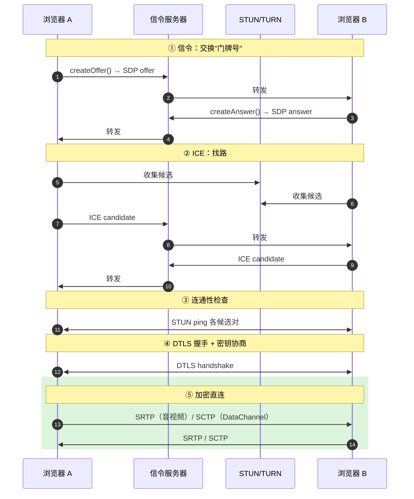

**几个关键点：**

- **信令不在标准内**：故意留给业务方自由实现
- **SDP**：交换"我支持哪些编码、IP、端口"的文本格式
- **DataChannel**：基于 SCTP-over-DTLS，可以传任意二进制数据，相当于浏览器里的 P2P TCP/UDP（Snapdrop、ShareDrop 等就靠它）
- **强制 HTTPS**：浏览器只在 HTTPS 页面允许 `getUserMedia` / `RTCPeerConnection`
- **天生加密**：所有 WebRTC 流量强制 DTLS+SRTP，没有"明文模式"

---

## 九、WireGuard — 现代加密 VPN 协议

**一句话**：极简、极快、内核级实现的 VPN 协议。

跟前面的东西**不在一个层面**：信令是"撮合者"，STUN/TURN 是"穿透手段"，**WireGuard 是路修好后跑的加密协议**。

### 设计原则

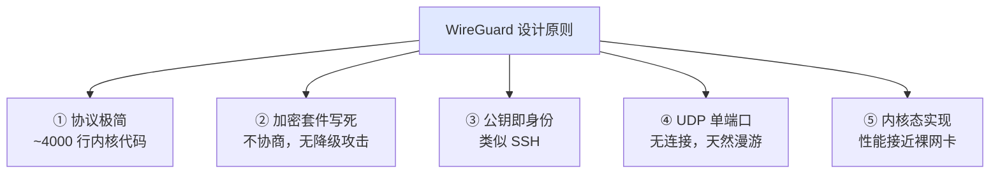

**加密套件（写死）**：ChaCha20-Poly1305 + Curve25519 + BLAKE2s + HKDF。没有协商就没有降级攻击。

### 配置长什么样

```ini
# /etc/wireguard/wg0.conf
[Interface]
PrivateKey = aBcD...
Address    = 10.0.0.1/24
ListenPort = 51820

[Peer]
PublicKey  = XyZ...
Endpoint   = 1.2.3.4:51820
AllowedIPs = 10.0.0.2/32
```

没有用户名密码，没有 PKI，**只有公钥配对**。

### 握手与漫游

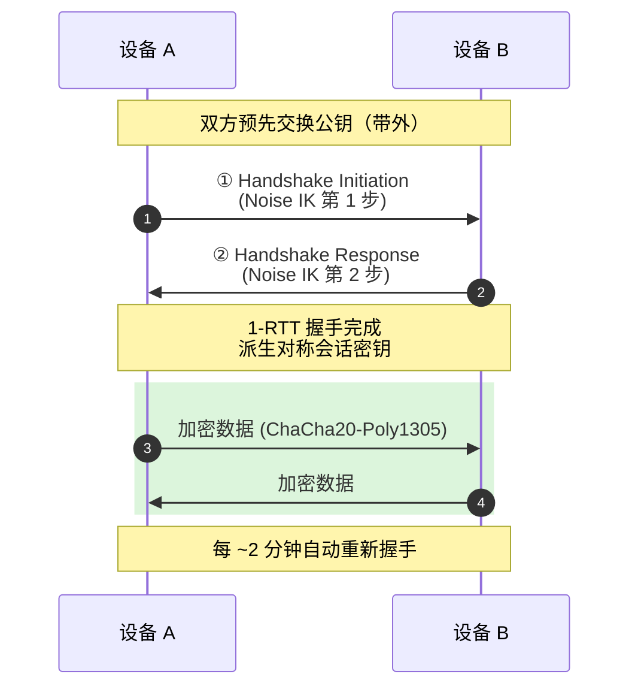

**漫游优势**：因为是 UDP 无连接 + 公钥识别对端，**切网络不断连**。从家里 WiFi 切到 4G，对端发现来源 IP 变了就自动更新 endpoint。

---

## 十、对比：ngrok / Tailscale / WebRTC

三套真实产品对应三种不同策略：

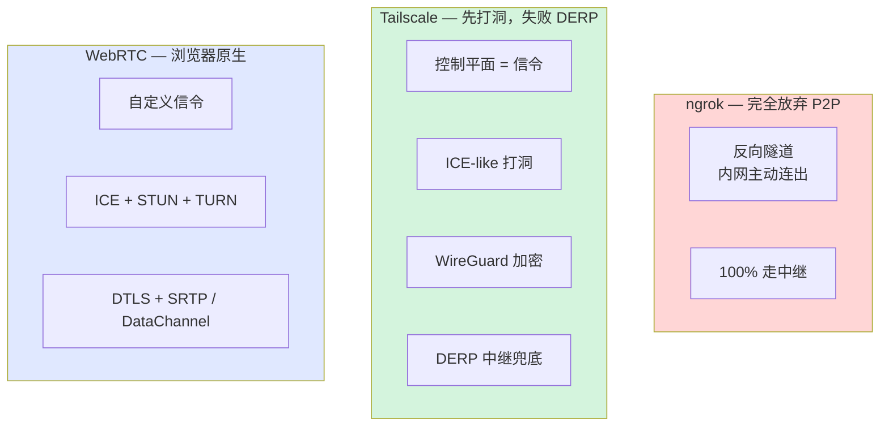

### ngrok：纯反向隧道

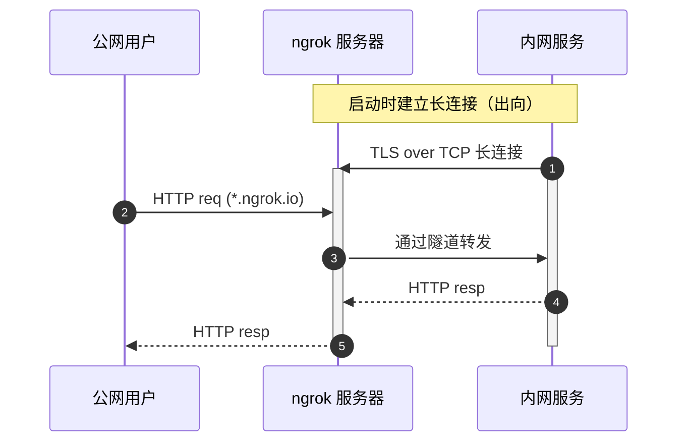

- 100% 走 ngrok 公网服务器中转，**不是 P2P**
- 不依赖 NAT 类型，只要能出网就能用
- 缺点：所有流量过 ngrok，带宽成本高、免费版限速；明文流量 ngrok 理论上能看到（除非端到端 TLS）
- 本质上等价于 `ssh -R` 反向隧道的产品化

### Tailscale：WireGuard + 自动化

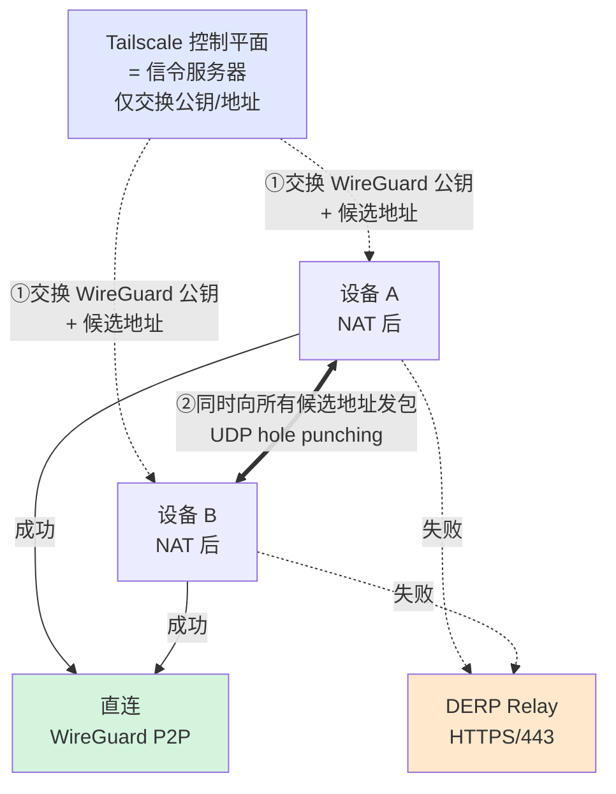

**关键技巧：**

1. **多候选地址并发尝试**（借鉴 ICE）：LAN / STUN 反射 / DERP，谁先通用谁
2. **DERP 兜底**：HTTPS/443，几乎不会被防火墙挡。WireGuard 端到端加密，DERP 只是哑管道
3. **Birthday paradox 应对 Symmetric NAT**：从多个本地端口同时打多个 hole，提高碰撞概率
4. **持续保活 + 路径升级**：即使在用 DERP，后台仍周期性重试直连；网络变化时重新协商

**Tailscale 痛点对照（vs 手工 WireGuard）：**

| 手工 WireGuard 痛点 | Tailscale 解决方案 |
|---|---|
| 公钥要手动复制粘贴 | 控制平面自动分发 |
| Endpoint 要手动填公网 IP/端口 | ICE 自动探测 |
| 双方都在 NAT 后就连不上 | DERP 中继兜底 |
| 加好友/踢人要改配置文件 | 控制台点几下 |
| 没有身份认证 | 集成 SSO |

> Slogan: **WireGuard, but easy**.

---

## 十一、归位总表

把所有名词放在三层框架里对照：

| 层 | 角色 | WebRTC | Tailscale | ngrok |
|---|---|---|---|---|
| 协调层 / 信令层 | 撮合者 | 自定义信令服务器（WebSocket 等） | 控制平面 | 注册时一条 TLS 长连接 |
| 路由层 / NAT 穿透层 | 找路 | ICE + STUN + TURN | ICE-like + DERP | **跳过**（直接走中继） |
| 加密传输层 | 跑数据 | DTLS + SRTP / SCTP | WireGuard | TLS |

**一句话总结：**

> **信令服务器**让两端"知道彼此存在"；
> **STUN/TURN/ICE** 让两端"找到一条能走的路"；
> **WireGuard / DTLS / TLS** 是路修好之后跑的加密协议。

---

## 附：常见问题速记

- **STUN 和信令服务器有啥区别？** STUN 只回答"你的公网地址是什么"，信令服务器交换 SDP/候选地址等元信息。两者都不传用户数据。
- **TURN 和 ngrok 有啥区别？** 都是公网中继，但 TURN 是 P2P 失败的兜底（先尝试直连），ngrok 是从一开始就走中继不打洞。
- **Tailscale 跟 WireGuard 的关系？** Tailscale 不替换 WireGuard，而是把它的公钥分发、Endpoint 探测、NAT 穿透自动化。
- **WebRTC 一定要 STUN/TURN 吗？** 不一定。同一个局域网两台浏览器靠 ICE 的本地候选就能连。STUN 用于跨 NAT，TURN 用于打不通时兜底。
- **Symmetric NAT 真的没救吗？** 几乎没救。Tailscale 用 Birthday paradox 多端口打洞能提高一点成功率，但仍不保证，最终还是 DERP/TURN 兜底。
